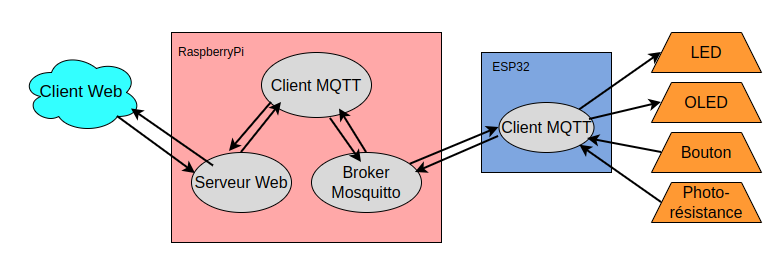

# Compte rendu Mini Projet IOC

Youba FERHOUNE 

Drifa AMIRI


## Introduction

Ce projet vise à créer un système qui permet de contrôler et de surveiller des capteurs et des actionneurs via une interface web. L'ESP32 est utilisé pour lire les données des capteurs (comme une photorésistance et un bouton poussoir) et contrôler des actionneurs (comme une LED et un écran OLED). La communication entre l'ESP32 et un serveur se fait via le protocole MQTT.

Le projet est divisé en deux parties principales : l'ESP32 et le serveur web. L'ESP32 publie les données des capteurs sur des topics MQTT et reçoit des commandes pour contrôler les actionneurs. Le serveur web offre une interface utilisateur pour afficher les données des capteurs et envoyer des commandes aux actionneurs. Cette interface est développée en HTML et CGI, et les commandes de l'utilisateur sont publiées sur les topics MQTT appropriés pour être traitées par l'ESP32.


**Remarque:** En raison de problèmes d'installation des packages sur la Raspberry Pi et de contraintes de temps, nous avons décidé de remplacer la Raspberry Pi par notre PC pour ce projet. Le client MQTT, le serveur Web, ainsi que le broker Mosquitto seront donc implémentés directement sur un PC linux au lieu de la Raspberry Pi. Cette approche est fonctionnellement équivalente, car la Raspberry Pi est essentiellement un mini-ordinateur. Par conséquent, dans le reste du rapport, nous mentionnerons la Raspberry Pi pour maintenir la cohérence et la clarté du projet.


# Sur la raspberry:

Sur la Raspberry Pi, pour lancer le broker MQTT et mettre en place le protocole de communication MQTT, on utilise la commande systemctl start mosquitto. Pour exécuter le broker MQTT en mode Verbose, on peut utiliser la commande sudo mosquitto -v. Pour vérifier si le broker est en cours d'exécution, on peut exécuter sudo netstat -tanlp | grep 1883. Enfin, pour arrêter le broker MQTT, on utilise la commande systemctl stop mosquitto.

Sur la Raspberry Pi, les tâches peuvent être divisées en trois composantes principales :


## Page web

**[http://localhost:8100/](https://)** : Cette page web sert d'interface utilisateur permettant de contrôler les capteurs et les actionneurs, ainsi que d'afficher les valeurs issues de ces derniers. Cette page, écrite en HTML, se compose principalement de quatre champs :

1. **Un champ de texte:** Permet d'envoyer des messages qui seront affichés sur l'écran OLED de l'ESP32.
2. **Un champ pour afficher la valeur du bouton poussoir :** Indique l'état actuel du bouton poussoir connecté à l'ESP32.
3. **Un champ pour afficher la valeur de la lumière :** Montre les lectures du capteur de photorésistance, représentant la luminosité ambiante.
4. **Un interrupteur :** Permet d'allumer ou d'éteindre la LED connectée à l'ESP32.

    


Le code est composé de deux parties principales : un fichier HTML intégré dans un script Python **main.py** et un script pour traiter les actions de l'utilisateur **led.py**.

La page se rafraîchit automatiquement toutes les **5 secondes** pour afficher les valeurs mises à jour. L'utilisateur peut saisir un message dans un champ de texte et soumettre le formulaire, ou utiliser un interrupteur pour allumer ou éteindre la LED. Lorsqu'un formulaire est soumis, le script **led.py** est appelé. Ce script redirige immédiatement l'utilisateur vers la page principale **main.py** après un délai **d'une seconde**, ce qui permet d'éviter les resoumissions répétées du formulaire. Ensemble, ces scripts fournissent une interface utilisateur complète pour interagir avec les capteurs et les actionneurs connectés à l'ESP32.


## Serveur http
Ce script en Python (server.py) configure et lance un serveur HTTP capable de traiter des requêtes CGI (Common Gateway Interface). Il importe les modules nécessaires (cgi, http.server, cgitb) et active le débogage CGI avec cgitb.enable(). Le serveur HTTP est créé en utilisant http.server.HTTPServer et utilise http.server.CGIHTTPRequestHandler comme gestionnaire de requêtes, spécifiant que les scripts CGI se trouvent dans le répertoire /www/cgi-bin. Le serveur écoute sur toutes les interfaces réseau disponibles sur le port **8100**, et la ligne httpd.serve_forever() lance le serveur pour qu'il traite les requêtes indéfiniment. Cela permet de traiter dynamiquement les requêtes web, comme celles envoyées par des formulaires HTML ou des scripts interactifs, avec un débogage détaillé en cas d'erreurs.

Pour lancer ce serveur, il faut tout d'abord se placer dans le répertoire /server/www, où se trouvent les fichiers à servir(cela garantit que le serveur peut accéder aux ressources nécessaires pour répondre aux requêtes HTTP de manière approprié). Ensuite, exécuter la commande suivante dans votre terminal : python ../server.py. Cela lancera le script server.py qui configure et démarre le serveur HTTP. 


## Client MQTT


Le client MQTT côté Raspberry Pi agit comme un intermédiaire pour récupérer les messages envoyés depuis l'ESP32 en s'abonnant aux topics MQTT correspondants. De plus, il permet l'envoi de messages vers l'ESP32 en publiant sur les topics appropriés les données entrées par l'utilisateur via la page web. Ce client peut donc être divisé en deux parties distinctes :


<center>

</center>

1. **Subscriber:** Cette partie est définie dans le fichier main.py. Elle permet au client de s'abonner aux topics MQTT "ESP/PhotoR" et "ESP/Bouton" afin de recevoir les messages envoyés par l'ESP32. Ces messages contiennent les valeurs de la photorésistance et de l'état du bouton.

    Pour commencer, la configuration du client MQTT est réalisée en créant une instance de **mqtt.Client()**. Cette instance permet d'établir une connexion avec le serveur MQTT et de gérer les communications.

    Définition des callbacks pour la réception des messages MQTT:

    Ensuite, des **callbacks** sont définis pour la réception des messages MQTT. La fonction on_button_message est appelée lorsque le client reçoit un message sur le topic **"ESP/Button"**. Cette fonction met à jour la variable button_value en fonction de la valeur reçue : **"0"** correspond à **"OFF"** et toute autre valeur correspond à **"ON"**. De manière similaire, la fonction on_photoR_message est appelée lorsque le client reçoit un message sur le topic **"ESP/PhotoR"**. Elle met à jour la variable **photoR_value** avec la valeur reçue du capteur de photorésistance.
    
    Pour permettre au client de commencer à écouter les messages entrants, la boucle MQTT est démarrée avec **mqttc.loop_start()**. Cette boucle reste active pour écouter et traiter les messages.

    Le code attend un court instant (1 seconde) pour permettre la réception des messages. Cela garantit que les messages envoyés par l'ESP32 sont bien reçus et traités par le client MQTT.

    Enfin, la boucle MQTT est arrêtée avec **mqttc.loop_stop()**, ce qui met fin à l'écoute active des messages. Cela permet de contrôler précisément quand le client doit cesser de traiter les messages entrants.


2. **Publisher:** il est definis dans le fichier **led.py** il permet de publier sur les topics ESP/Led et ESP/Oled solicité par le main apres que l'utilisateur entre change l'etat de la Led ou bien entre un nouveau message 

    Récupèration des valeurs soumises via le formulaire web en utilisant cgi.FieldStorage(). Les valeurs des champs val et led sont stockées respectivement dans les variables val et led_state.
    ```cpp
    form = cgi.FieldStorage()
    val = form.getvalue('val')
    led_state = form.getvalue('led')
    ```

    La fonction **publish_mqtt** prend deux arguments : **topic** et **message**. Elle utilise la fonction **publish.single** de la bibliothèque paho.mqtt pour publier un message sur le topic spécifié, se connectant au serveur MQTT situé à l'adresse IP **"172.20.10.12"**.

    ```cpp
    def publish_mqtt(topic, message):
        publish.single(topic, message, hostname="172.20.10.12")
    ```


## Sur l'ESP32

L'ESP32 sert d'interface entre les capteurs et les actionneurs. En utilisant le protocole **MQTT**, le client MQTT sur l'ESP32 peut publier ("publish") des messages vers le serveur MQTT sur les topics ESP/Button et ESP/PhotoR, et s'abonner ("subscribe") aux topics ESP/Led et ESP/Oled pour recevoir des messages. Ce mécanisme permet une communication bidirectionnelle efficace et en temps réel.


1. Pour mettre en place le protocole MQTT, l'ESP32 doit être connecté à un réseau WiFi, et il est impératif que ce réseau soit le même que celui sur lequel notre broker MQTT est en cours d'exécution. Pour cela, nous utilisons la bibliothèque WiFi fournie avec l'ESP32, nous initialisons la connexion WiFi en utilisant le nom du réseau (SSID) et le mot de passe associé (password). Cette configuration est réalisée dans la fonction **setup_wifi()**, qui est bloquante, assurant ainsi la connexion au WiFi. Si la connexion échoue, la fonction tente de se reconnecter toutes les 500 millisecondes.
    ```cpp
    WiFi.begin(ssid, password);
    ```

2. Ensuite nous Pour établir une connexion MQTT, nous devons créer un client MQTT en spécifiant l'adresse du serveur MQTT (l'adresse IP) et le port d'écoute par defaut (1883), Ensuite s'abonner aux topics, toutes ces configurations sont effectuées par la fonction **connect_rpi**, comme indiqué dans le fichier client_MQTT.ino.
    ```cpp
     //initialiser le client MQTT
    PubSubClient client(mqttServer, mqttPort, WifiClient);
    //configuration du client MQTT
    client.setServer(mqttServer, mqttPort);
    ```
    ```cpp
    //s'abonner aux topics
    client.subscribe("ESP/Led");
    client.subscribe("ESP/Oled");
    ```


3. La fonction **callback** est appelée chaque fois qu'un message est reçu sur un topic auquel l'ESP32 est abonné. Elle imprime d'abord le topic et le message reçu sur le port série. Ensuite, elle compare le topic pour déterminer l'action à effectuer. Si le message provient du topic "**ESP/Led**", la fonction vérifie si le message est "ON" ou "OFF" et allume ou éteint la LED en conséquence. Si le message provient du topic "ESP/Oled", elle copie le message dans **mailbox1.message**, met à jour l'état de la mailbox à "FULL", pour que ensuite le message sera affiché sur l'écran OLED. L'affichage de ce dernier est pris en charge par la fonction **loop_oled()**, qui se contente d'afficher les messages écrits dans la **mailbox1** périodiquement.

    ```cpp
     if(strcmp(topic, "ESP/Led")==0){
        if(strncmp(mailbox2.message, "ON", 2) == 0)
        {
          Serial.println("LED ON");
          digitalWrite(LED_PIN, HIGH);
        }
        ....
    ```

4. Pour envoyer les données des capteurs, nous avons mis en place deux fonctions : **publishButtonValue()** et **publishPhotoRValue()**, qui sont exécutées périodiquement dans la boucle principale (void loop()). La fonction **publishButtonValue()** lit l'état du bouton-poussoir et publie cette valeur sur le topic MQTT **ESP/Button.** De même, la fonction **publishPhotoRValue()** lit la valeur du capteur de photorésistance, ajuste la valeur, et la publie sur le topic **ESP/PhotoR**. Ces publications permettent à tout abonné aux topics appropriés de recevoir et traiter les données en temps réel.

    ```cpp
    //Publier la valeur dans les topics
    client.publish("ESP/Button", message);
    client.publish("ESP/PhotoR", message);
    ```
<center>  
    

</center>center>

# Conclusion:
Notre travail est un prototype minimal mais fonctionnel qui peut être développée davantage pour répondre à des besoins spécifiques. Par exemple, on pourrait intégrer davantage de capteurs pour surveiller d'autres paramètres environnementaux tels que la température, l'humidité ou la qualité de l'air. De plus, on pourrait étendre les fonctionnalités de l'interface web pour permettre une interaction plus complexe avec les actionneurs, comme la mise en place de scénarios automatisés basés sur des conditions prédéfinies. Enfin, ce type de système peut être appliqué dans de nombreux contextes pratiques, tels que la domotique pour contrôler l'éclairage et les appareils électroménagers, la surveillance environnementale dans les serres agricoles, ou même la gestion des stocks dans les entrepôts.

<center>    
<a href="[lien_de_la_source](https://www.batirama.com/article/34062-la-montee-en-puissance-de-la-domotique.html)" target="_blank">

</a>
</center>
